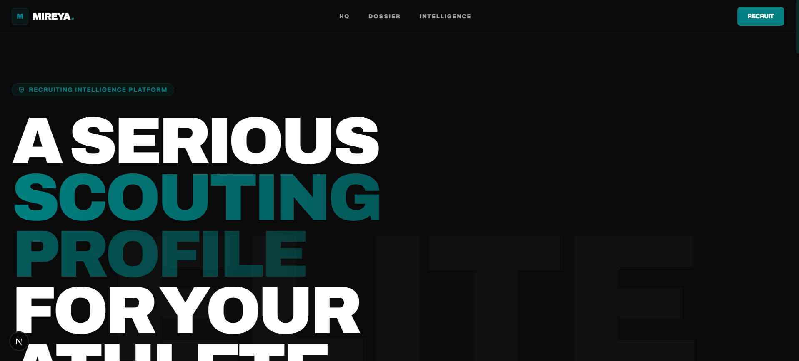
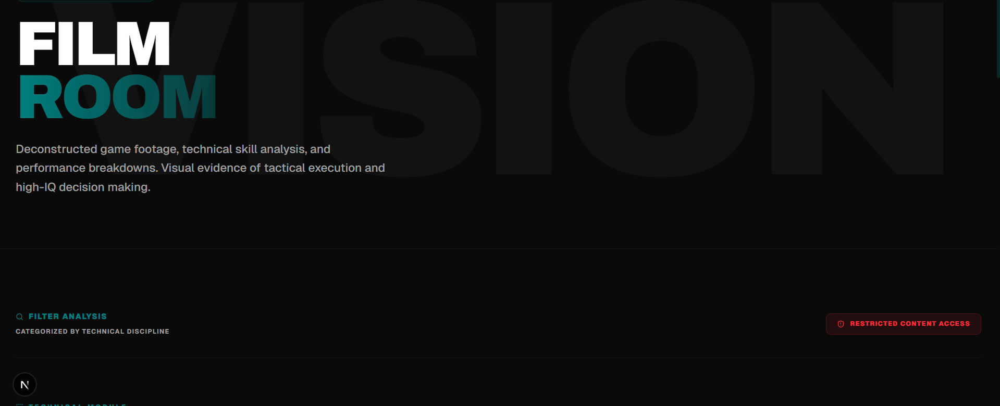

<!--
   ________    _________  _______
  / ____/ /   /  _/_  __/ / ____/
 / __/ / /    / /  / /   / __/   
/ /___/ /____/ /  / /   / /___   
/_____/_____/___/ /_/   /_____/   
                                 
    ____  ____  ____  _____ ____  _________________
   / __ \/ __ \/ __ \/ ___// __ \/ ____/ ____/_  __/
  / /_/ / /_/ / / / /\__ \/ /_/ / __/ / /     / /   
 / ____/ _, _/ /_/ /___/ / ____/ /___/ /___  / /    
/_/   /_/ |_|\____//____/_/   /_____/\____/ /_/     
Elite Prospect
Version 1.0.0
-->

<div align="center">
  
# 🚀 Elite Prospect

### Premium Digital Scouting Dossiers - Professionalizing the Youth Recruiting Presence

[](LICENSE)
[](https://github.com/rayanthoney/ram911_Leslie-portfolio/releases)
[](https://github.com/rayanthoney/ram911_Leslie-portfolio/actions)
[](http://makeapullrequest.com)

[**Live Demo**](https://ram911-Leslie-portfolio.vercel.app/) · [**Documentation**](./docs) · [**Report Bug**](https://github.com/rayanthoney/ram911_Leslie-portfolio/issues) · [**Request Feature**](https://github.com/rayanthoney/ram911_Leslie-portfolio/issues)



</div>

---

## 📋 Table of Contents

- [About The Project](#about-the-project)
- [✨ Features](#features)
- [🎯 Demo](#demo)
- [⚙️ Tech Stack](#tech-stack)
- [🚀 Getting Started](#getting-started)
  - [Prerequisites](#prerequisites)
  - [Installation](#installation)
- [💻 Usage](#usage)
- [📸 Screenshots](#screenshots)
- [🗺️ Roadmap](#roadmap)
- [🤝 Contributing](#contributing)
- [📜 License](#license)
- [👤 Contact](#contact)
- [🙏 Acknowledgments](#acknowledgments)

---

## 📖 About The Project

<div align="center">

</div>

**Elite Prospect** is a premium, link-friendly digital scouting dossier designed for youth athletes. It transforms standard highlight reels into deep technical evaluations that college coaches and scouts can digest in under 30 seconds.

### Why Elite Prospect?

- 🎯 **Scout-Centric Design** - Built for the way coaches actually evaluate film and metrics.
- 🛡️ **Privacy First** - Hard requirements for minor protection (no addresses, school names, or exact locations).
- ⚡ **Professional Presence** - A single, high-impact link that replaces messy PDFs and disparate social media clips.

<p align="right">(<a href="#top">back to top</a>)</p>

---

## ✨ Features

<div align="center">

| Feature | Description |
|---------|-------------|
| 📊 **Technical Dashboard** | HUD-style metrics and "Verified" status for elite athletes. |
| 🎥 **Intelligence Feed** | Skill-specific film galleries (Handles, Shooting, Defense). |
| 📜 **Career Dossier** | Vertical timeline tracking seasons, roles, and competitive growth. |
| 🛡️ **Recruit Protocol** | Secure communication terminal for audited recruiter outreach. |
| 📱 **Mobile Optimized** | Designed for on-the-sideline evaluation on mobile devices. |
| 💾 **Scalable Engine** | JSON-based file system allows for rapid athlete profile generation. |

</div>

<p align="right">(<a href="#top">back to top</a>)</p>

---

## 🎯 Demo

### 🌐 Live Demo

Check out the live application: **[Elite Prospect Live Demo](https://ram911-Leslie-portfolio.vercel.app/)**

### 🎥 Player Profile Preview

An example profile (Leslie R.) is available at `/players/Leslie-r`.

<p align="right">(<a href="#top">back to top</a>)</p>

---

## ⚙️ Tech Stack

### Frontend & Core
[](https://nextjs.org/)
[](https://react.dev/)
[](https://www.typescriptlang.org/)
[](https://tailwindcss.com/)
[](https://greensock.com/gsap/)

### UI Components
[](https://lucide.dev/)
[](https://www.radix-ui.com/)

### Tools
[](https://git-scm.com/)
[](https://prettier.io/)

<p align="right">(<a href="#top">back to top</a>)</p>

---

<details>
<summary><h2>🚀 Getting Started (Click to Expand)</h2></summary>

### Prerequisites

- **Node.js** (v18 or higher)
- **npm** or **pnpm**

### Installation

1. **Clone the repository**
   ```sh
   git clone https://github.com/rayanthoney/ram911_Leslie-portfolio.git
   ```

2. **Install dependencies**
   ```sh
   npm install
   ```

3. **Start the development server**
   ```sh
   npm run dev
   ```

4. **Navigate to** `http://localhost:3000`

</details>

<p align="right">(<a href="#top">back to top</a>)</p>

---

<details>
<summary><h2>💻 Usage (Click to Expand)</h2></summary>

### Adding a New Athlete

1. Create a new JSON file in `src/data/players/[slug].json`.
2. Populate the athlete data following the standardized schema:
   ```json
   {
     "slug": "player-name",
     "displayName": "Player P.",
     "position": "Guard",
     "classYear": 2030,
     "number": "00",
     "bio": "...",
     "strengths": ["Shooting", "Defense"],
     "highlightReelUrl": "https://youtube.com/...",
     "filmClips": []
   }
   ```
3. The dynamic profile will be instantly available at `/players/[slug]`.

### Updating the Journey

Edit `src/data/journey.json` to update the global vertical timeline of seasons and achievements.

</details>

<p align="right">(<a href="#top">back to top</a>)</p>

---

<details>
<summary><h2>📸 Screenshots (Click to Expand)</h2></summary>

<div align="center">

<!-- Screenshots of the Editorial Hero and Scouting Analysis go here -->

</div>

</details>

<p align="right">(<a href="#top">back to top</a>)</p>

---

## 🗺️ Roadmap

- [x] **Phase 1: Foundation**
  - [x] Standardize data types and scalable file structure
  - [x] Implement core data-layer lib
- [x] **Phase 2: Dynamic Engine**
  - [x] Build dynamic `/players/[slug]` routes
  - [x] Implement SEO/Metadata (OG Images) for athlete sharing
- [x] **Phase 3: Marketing & Conversion**
  - [x] High-premium Editorial Homepage
  - [x] Interactive Branding (GSAP animations, HUD elements)
- [ ] **Phase 4: Polish & Scale**
  - [ ] Implement Intake Form states
  - [ ] Automated image optimization pipeline
  - [ ] Multi-sport support templates

<p align="right">(<a href="#top">back to top</a>)</p>

---

<details>
<summary><h2>🤝 Contributing (Click to Expand)</h2></summary>

We welcome contributions to the Elite Prospect platform!

1. **Fork the Project**
2. **Create your Feature Branch** (`git checkout -b feature/AmazingFeature`)
3. **Commit your Changes** (`git commit -m 'Add some AmazingFeature'`)
4. **Push to the Branch** (`git push origin feature/AmazingFeature`)
5. **Open a Pull Request**

</details>

<p align="right">(<a href="#top">back to top</a>)</p>

---

## 📜 License

Distributed under the MIT License. See `LICENSE` for more information.

<p align="right">(<a href="#top">back to top</a>)</p>

---

## 👤 Contact

**RayAnthoney**

[](https://github.com/rayanthoney)
[](https://rayanthone.com)

**Project Link:** [https://github.com/rayanthoney/ram911_Leslie-portfolio](https://github.com/rayanthoney/ram911_Leslie-portfolio)

<p align="right">(<a href="#top">back to top</a>)</p>

---

## 🙏 Acknowledgments

* [Next.js](https://nextjs.org/)
* [Tailwind CSS](https://tailwindcss.com/)
* [Greensock (GSAP)](https://greensock.com/)
* [Lucide Icons](https://lucide.dev/)
* [shadcn/ui](https://ui.shadcn.com/)

---

<div align="center">

### ⭐ Star this repo if you find it helpful!

Made with ❤️ by RayAnthoney's Antigravity


</div>
